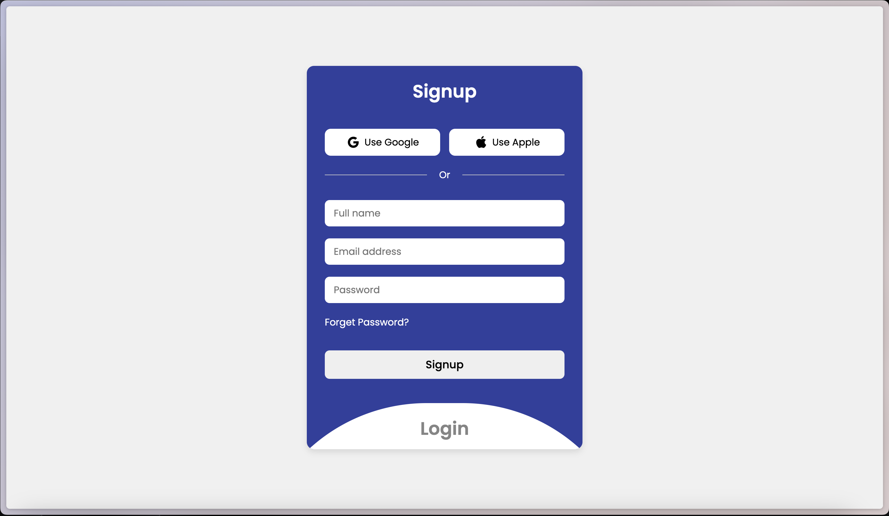

# Design de Login Animado

Este projeto implementa um design de página de login animado usando HTML, CSS e JavaScript.

## Prévia



## Recursos

- Transição animada entre as seções de cadastro e login.
- Botões de login social para Google e Apple.
- Design responsivo.
- Link para esqueci minha senha.

## Começando

Para obter uma cópia local funcionando, siga estes passos simples.

### Pré-requisitos

Certifique-se de ter os seguintes itens instalados:

- Navegador da web

### Instalação

1. Clone o repositório
   ```sh
   git clone https://github.com/ClaudioAMF1/Animated-login
